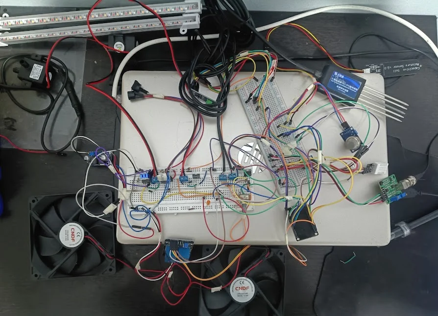

# TomaCare

Hello, my name is Esteban, and I've been developing my personal project, TomaCare, with the help of HackClub. My goal is to create a revolutionary tool for the Colombian Andean region, specifically for the Central Western Metropolitan Area (AMCO) and its surrounding rural and mountainous areas, to cultivate tomatoes with greater control and ease.

TomaCare is an intelligent agent based on models with an IoT system designed to improve climate control in Chonto tomato crops in the region. It will maintain constant soil temperature and humidity, as well as automated light levels, CO2 levels, and irrigation times. It will also provide alerts for the pH of the fertigation water and nutrient levels in the soil. TomaCare aims to improve greenhouse autonomy and eliminate human error, as well as address the challenges of immediate action due to the region's characteristically changeable climate.

TomaCare

"A new way to grow"

Built specifically for medium-scale Colombian farmers in the Risaralda region.

Components and Technologies

BOM

| ITEM                                           | PRICE $ | QUANTITY | PURPOSE                                         | LINK                                                                                                                                                                                                                            |
|-------------------------------------------------|---------|----------|---------------------------------------------------|-----------------------------------------------------------------------------------------------------------------------------------------------------------------------------------------------------------------------------|
| DHT22 - AM2302                                 | 5.97    | 1        | Air Temperature & Humidity Sensor               | https://dualtronica.com/inicio/415-sensor-de-temperatura-y-humedad-dht22-am2302.html                                                                                                                                            |
| Capacitive Soil Moisture Sensor - 80443        | 4.71    | 1        | Soil Moisture Sensor                            | https://dualtronica.com/modulos/707-sensor-humedad-de-suelo-higrometro-capacitivo.html                                                                                                                                          |
| MQ135 - 208                                    | 3.77    | 1        | CO2 Sensor                                      | https://dualtronica.com/sensores/364-sensor-mq135-calidad-de-aire.html                                                                                                                                                          |
| Water pH Module SEN0161 (Arduino)              | 14.71   | 1        | Water pH Signal Conditioning Module             | https://www.mercadolibre.com.co/sensor-de-ph-para-arduino-sen0161/p/MCO2046517447                                                                                                                                               |
| Water pH Probe 0-14 (non-rechargeable)         | 13.2    | 1        | Water pH Sensor                                 | https://www.mercadolibre.com.co/sonda-de-ph-014-no-recargable-uso-en-acuarios-o-hidroponia/up/MCOU2426494969                                                                                                                    |
| BH1750 (0-65535 lx)                            | 4.59    | 1        | Internal Lux Sensor                             | https://www.mercadolibre.com.co/sensor-de-luz-gy-302-bh1750-arduino-sensor-de-iluminacion/p/MCO2042127034                                                                                                                       |
| RS485 Soil Probe                               | 84.85   | 1        | Soil pH/Temperature/Humidity/EC Sensor          | https://www.electronicasafg.com/productos/sensor-suelo-tierra-ph-temperatura-humedad-ce-rs485-arduino/                                                                                                                          |
| Exhaust Fan (undefined size) 12V DC            | 2.83    | 1        | Heater                                          | https://dualtronica.com/inicio/994-ventilador-extractor-60x60x25-mm-12v.html                                                                                                                                                    |
| Exhaust Fan 4.75'' 120x120x25mm 24V DC         | 5.03    | 1        | Ventilation Fan                                 | https://dualtronica.com/motores/813-ventilador-extractor-475-120x120x25mm-24vdc.html                                                                                                                                            |
| Exhaust Fan 4.75'' 120x120x25mm 24V DC         | 5.03    | 1        | Extractor Fan                                   | https://dualtronica.com/motores/813-ventilador-extractor-475-120x120x25mm-24vdc.html                                                                                                                                            |
| Submersible Water Pump 12V 4.2W 240L/H - 80650 | 13.2    | 1        | Humidifier Water Pump                           | https://dualtronica.com/motores/818-mini-bomba-sumergible-12vdc-48w-para-agua.html                                                                                                                                              |
| Submersible Water Pump 12V 4.2W 240L/H - 80650 | 13.2    | 1        | Irrigation Water Pump                           | https://dualtronica.com/motores/818-mini-bomba-sumergible-12vdc-48w-para-agua.html                                                                                                                                              |
| Mixed Color Grow Light Strips RTUSZWLYDT-MIX   | 36.68   | 1        | Grow Lights                                     | https://www.mercadolibre.com.co/tiras-de-luz-de-cultivo-de-colores-mixtos/up/MCOU3877671963                                                                                                                                     |
| PTC Heating Element 12V 240C (Incubator type)  | 11.0    | 1        | Heater                                          | https://www.mercadolibre.com.co/resistencia-calefactora-ptc-12v-240c-ideal-para-incubadoras/up/MCOU3184930300                                                                                                                   |
| Heat Sink x2                                   | 5.03    | 1        | Heater                                          | https://dualtronica.com/raspberry-pi/720-disipadores-en-aluminio-para-raspberry-pi-4.html                                                                                                                                       |
| Ultrasonic Humidifier Module 5V USB-C          | 4.71    | 1        | Humidifier                                      | https://dualtronica.com/modulos/922-modulo-humificador-5v-con-filtro-usb-c.html                                                                                                                                                 |
| Active Buzzer 5V 12x9.5mm                      | 0.47    | 1        | pH Alert                                        | https://dualtronica.com/miscelanea/633-buzzer-activo-5v-zumbador-12x95mm-arduino.html                                                                                                                                           |
| Active Buzzer Module                           | 0.47    | 1        | pH Alert                                        | https://dualtronica.com/modulos/634-modulo-buzzer-zumbador-33v-5v.html                                                                                                                                                          |
| Active Buzzer 5V 12x9.5mm                      | 0.47    | 1        | EC Alert (rising level)                         | https://dualtronica.com/miscelanea/633-buzzer-activo-5v-zumbador-12x95mm-arduino.html                                                                                                                                           |
| Active Buzzer Module                           | 1.57    | 1        | EC Alert (rising level)                         | https://dualtronica.com/modulos/634-modulo-buzzer-zumbador-33v-5v.html                                                                                                                                                          |
| OLED Display 3cm                               | 0.0     | 1        | Alerts / Status Display                         | https://dualtronica.com/pantallas/685-pantalla-oled-13-azul-comunicacion-i2c-128x64.html                                                                                                                                        |
| ESP32S                                         | 10.69   | 1        | Microcontroller                                 | https://dualtronica.com/tarjetas-desarrollo/1020-tarjeta-esp32-s3-n16r8-devkitc-44-pines-doble-usb-c.html                                                                                                                       |
| MOSFET IRFZ44N TO-220                          | 0.94    | 1        | Grow Light PWM Control                          | https://dualtronica.com/componentes-electronicos/972-mosfet-irfz44n-to-220.html                                                                                                                                                 |
| MOSFET IRF540N TO-220 x1                       | 0.79    | 1        | Irrigation Pump Switching (12V)                 | https://dualtronica.com/componentes-electronicos/973-mosfet-irf540-to-220.html                                                                                                                                                  |
| MOSFET IRF540N TO-220 x1                       | 0.79    | 1        | Humidifier Pump Switching (12V)                 | https://dualtronica.com/componentes-electronicos/973-mosfet-irf540-to-220.html                                                                                                                                                  |
| MOSFET IRF540N TO-220 x2                       | 1.57    | 1        | PTC Heater Control (12V)                        | https://dualtronica.com/componentes-electronicos/973-mosfet-irf540-to-220.html                                                                                                                                                  |
| 2-Channel Relay Module 5V                      | 3.77    | 1        | Fan / Extractor Control                         | https://dualtronica.com/modulos/168-modulo-rele-2-canales.html                                                                                                                                                                  |
| 1-Channel Relay Module 5V                      | 2.51    | 1        | Humidifier Control                              | https://dualtronica.com/modulos/55-modulo-rele-1-canal.html                                                                                                                                                                     |
| TTL to RS485 Module (MAX485, UART to RS485 5V) | 1.89    | 1        | Soil Sensor Interface                           | https://dualtronica.com/modulos/55-modulo-rele-1-canal.html                                                                                                                                                                     |
| Boost Converter Module XL6009 12V->24V         | 3.14    | 1        | Fan Voltage Boost                               | https://dualtronica.com/modulos/574-convertidor-dc-dc-elevador-y-reductor-xl6009-lm2577s-buck-boost-2-en-1.html                                                                                                                 |
| Diode 1N4007 x20                               | 1.59    | 1        | Flyback Protection (PTC, Pumps, Fan, Extractor) | https://dualtronica.com/componentes-electronicos/754-diodo-rectificador-1n4007-1a-1000v.html                                                                                                                                    |
| Capacitor 100uF 25V x5                         | 1.57    | 1        | Power Rail Filtering                            | https://www.google.com/maps/place/Mundo+Digital+S.E/@4.8152129,-75.6919154,128m/...                                                                                                                                             |
| Resistor 10K ohm x2                            | 0.38    | 1        | DHT22 Pull-up                                   | https://www.google.com/maps/place/Mundo+Digital+S.E/@4.8152129,-75.6919154,128m/...                                                                                                                                             |
| Resistor 1K ohm x4                             | 0.75    | 1        | IRF540N Gate Resistor (Irrigation Pump)         | https://www.google.com/maps/place/Mundo+Digital+S.E/@4.8152129,-75.6919154,128m/...                                                                                                                                             |
| Resistor 1K ohm x4                             | 0.75    | 1        | IRF540N Gate Resistor (Humidifier Pump)         | https://www.google.com/maps/place/Mundo+Digital+S.E/@4.8152129,-75.6919154,128m/...                                                                                                                                             |
| 2-Pin Blue Terminal Block x10                  | 1.89    | 1        | ESP32 to Power Actuator Wiring                  | https://www.google.com/maps/place/Mundo+Digital+S.E/@4.8152129,-75.6919154,128m/...                                                                                                                                             |

Sensors

DHT22
Capacitive sensor (SEN0193)
BH1750
MQ135
SEN0161 + probe
RS485 multiparameter sensor

Actuators

2x 12V DC submersible water pump — MOSFET IRF540N
Fan and extractor 24V DC — 2-channel relay + XL6009 converter
Heater (12V PTC resistor) — MOSFET IRF540N
5V ultrasonic humidifier — 1-channel relay
Grow LED strips — MOSFET IRFZ44N with PWM
Servo-motor shade/blind system
Active buzzer and warning LEDs

Processing

ESP32

Software / Communication

Wi-Fi
MQTT
Modbus over RS485
Arduino IDE / C++
Firebase
HTML5

Model-Based Intelligent Agent (ABM)

Expert / knowledge-based system
Multilayer perceptron neural network
Memory module

Project Status

The project is still in development, but due to its hardware limitations(for now), it is impossible to release a real demo.
All sensors and actuator working together, the next step is to adapt it to a Firebase Database.

Actual Circuit

Actual Wiring Diagram

  

Author

Esteban Castaño Castaño
